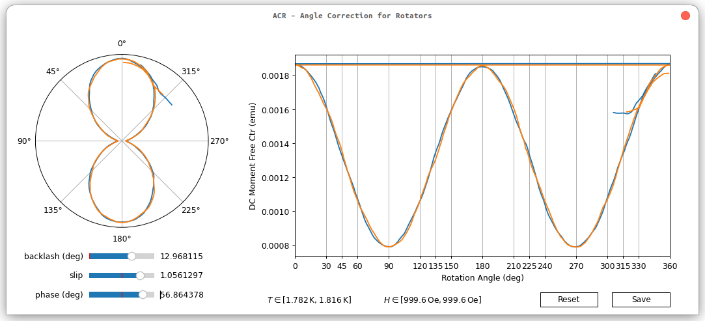

# ACR – Angle Correction for Rotators

Simple script to load data from a rotator and correct for common errors in a rotator setup.

## Dependencies
- `python`
- `numpy`
- `matplotlib`

## Prerequisites

- Rotation should be performed at otherwise stable conditions.
- Only one rotation per file
- To correct for backlash a forward and backward rotation has to be performed.
- To correct for slip ideally at least a 360° rotation has to be performed
- To correct for an initial phase in a meaningful way, you have a look at your sample when installing it.

## Usage

Run
```sh
python acr.py -i inputfile.dat -o outputfile.acr.dat
```
Then adjust your parameters in the GUI.

Use this at your own risk and check the contents of the script beforehand.


